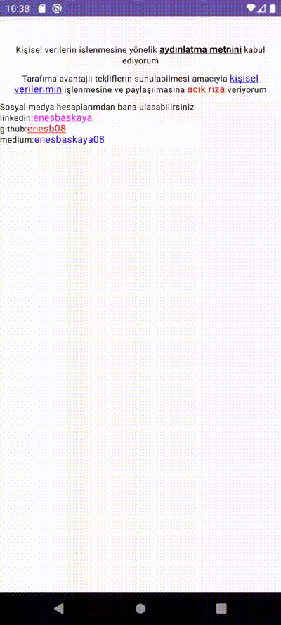

[](https://jitpack.io/#enesb08/SpannableText)

SpannableText , Android uygulamaları için özel stil ve font ile tıklanabilir metinler oluşturmanızı sağlar

## Nasıl Kullanılır

1. **Projeye Ekleme:**
 - Projenizin `build.gradle` dosyasına aşağıdaki bağımlılığı ekleyin:

 ```gradle
   dependencies {
	 implementation 'com.github.enesb08:SpannableText:Tag'
   ```
  - Projenizin `settings.gradle` dosyasına aşağıdaki bağımlılığı ekleyin:
  
  
   Eklencek kod:
 ```gradle
 maven {
         url = uri("https://jitpack.io")
     }
  ```
  Eklenecek kısım:
 ```gradle
  dependencyResolutionManagement {
    repositoriesMode.set(RepositoriesMode.FAIL_ON_PROJECT_REPOS)
    repositories {
        google()
        mavenCentral()
        maven {
            url = uri("https://jitpack.io")
        }
    }
}
  
  ```
2. **Kullanım Örnekleri:**
 -  Sample:1
```kotlin
@Composable
fun Sample1() {
    val spannableText1 = "aydınlatma metnini"

    val visibilityDescription =
        "Kişisel verilerin işlenmesine yönelik aydınlatma metnini kabul ediyorum"

    Box(modifier = Modifier.background(Color.White)) {
        SpannableText(
            fullText = visibilityDescription,
            defTextStyle = MaterialTheme.typography.bodySmall.copy(
                textAlign = TextAlign.Center
            ),
            data = listOf(
                SpannableTextData(
                    text = spannableText1,
                    tag = "tag",
                    isHaveUnderLine = true,
                    annotation = "tag_url",
                    spannableTextStyle = MaterialTheme.typography.labelLarge,
                    onClick = {
                        Log.e("SpannableTextData", "it=$it")

                    }
                )
            )
        )
    }
}
```
 -  Sample:2
```kotlin
@Composable
fun Sample2() {
    val spannableText1 = "acık rıza"
    val spannableText2 = "kişisel verilerimin"

    val visibilityDescription =
        "Tarafıma avantajlı tekliflerin sunulabilmesi amacıyla kişisel verilerimin işlenmesine ve paylaşılmasına acık rıza veriyorum"

    Box(modifier = Modifier.background(Color.White)) {
        SpannableText(
            fullText = visibilityDescription,
            defTextStyle = MaterialTheme.typography.bodySmall.copy(
                textAlign = TextAlign.Center
            ),
            data = listOf(
                SpannableTextData(
                    text = spannableText1,
                    spannableTextStyle = MaterialTheme.typography.bodyMedium.copy(color = Color.Red)
                ),
                SpannableTextData(
                    text = spannableText2,
                    isHaveUnderLine = true,
                    spannableTextStyle = MaterialTheme.typography.bodyMedium.copy(color = Color.Blue)
                )
            )
        )
    }
}
```

 -  Sample:3
```kotlin
@Composable
fun Sample3() {
    val context = LocalContext.current
    val spannableText1 = "enesbaskaya"
    val spannableText2 = "enesb08"
    val spannableText3 = "enesbaskaya08"


    val visibilityDescription =
        "Sosyal medya hesaplarımdan bana ulasabilirsiniz" +
                "\nlinkedin:$spannableText1" +
                "\ngithub:$spannableText2" +
                "\nmedium:$spannableText3"

    val list = listOf(
        SpannableTextData(
            text = spannableText1,
            spannableTextStyle = MaterialTheme.typography.bodyMedium.copy(color = Color.Magenta),
            isHaveUnderLine = true,
            tag = "linkedin",
            annotation = "https://www.linkedin.com/in/enesbaskaya/",

            ),
        SpannableTextData(
            text = spannableText2,
            spannableTextStyle = MaterialTheme.typography.bodyMedium.copy(color = Color.Red),
            isHaveUnderLine = true,
            tag = "github",
            annotation = "https://github.com/enesb08/",


            ),
        SpannableTextData(
            text = spannableText3,
            spannableTextStyle = MaterialTheme.typography.bodyMedium.copy(color = Color.Blue),
            tag = "medium",
            annotation = "https://enesbaskaya08.medium.com/",


            )
    )

    list.forEach {
        it.onClick = {
            Log.e("openLink", "link=" + it.item)
            Log.e("openLink", "tag=" + it.tag)

        }
    }


    Box(modifier = Modifier.background(Color.White)) {
        SpannableText(
            fullText = visibilityDescription,
            defTextStyle = MaterialTheme.typography.bodySmall.copy(
                textAlign = TextAlign.Left
            ),
            data = list
        )
    }
}
```
3. **GIF:**

<p align="start">
 
</p>

<div align="start"> <h2 align="start">License</h1> </div>

``` xml

Copyright 2024 enesb08

Licensed under the Apache License, Version 2.0 (the "License");
you may not use this file except in compliance with the License.
You may obtain a copy of the License at

   http://www.apache.org/licenses/LICENSE-2.0
